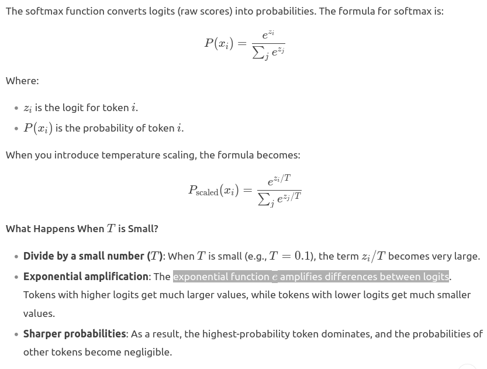

# Overview
This repository contains code implementation with **my modifications** for the book [Building LLM from scratch](https://github.com/rasbt/LLMs-from-scratch).

# Notes:
### Chapter 3: `Coding Attention Mechanism`


> We can improve the SelfAttention_v1 implementation further by utilizing PyTorch’s nn.Linear layers, which effectively perform matrix multiplication when the bias units are disabled. Additionally, a significant advantage of using nn.Linear instead of manually implementing nn.Parameter(torch.rand(...)) is that nn.Linear has an optimized weight initialization scheme, contributing to more stable and effective model training.

> `Causal attention`, also known as `masked attention`, is a specialized form of self-attention. It restricts a model **to only consider previous and current inputs** in a sequence when processing any given token when computing attention scores. **This is in contrast to the standard self-attention mechanism, which allows access to the entire input sequence at once.**

> While all added code lines should be familiar at this point, we now added a `self.register_buffer()` call in the `__init__` method. The use of register_buffer in PyTorch is not strictly necessary for all use cases but offers several advantages here. For instance, when we use the CausalAttention class in our LLM, **buffers are automatically moved to the appropriate device (CPU or GPU) along with our model**, which will be relevant when training our LLM. This means we don’t need to manually ensure these tensors are on the same device as your model parameters, avoiding device mismatch errors.<br><br>
If you have parameters in your model, which should be saved and restored in the `state_dict`, but not trained by the optimizer, you should register them as buffers.
Buffers won’t be returned in `model.parameters()`, so that the optimizer won’t have a change to update them.

> We mask out the attention weights above the diagonal, and we **normalize the nonmasked** attention weights such that the attention weights sum to 1 in each row.


> **Information leakage** <br><br>
When we apply a mask and then renormalize the attention weights, **it might initially appear that information from future tokens (which we intend to mask)** could still influence the current token because their values are part of the softmax calculation. However, the key insight is that when we renormalize the attention weights after masking, what we’re essentially doing is recalculating the softmax over a smaller subset (since masked positions don’t contribute to the softmax value). <br><br>
The mathematical elegance of softmax is that despite initially including all positions in the denominator, **after masking and renormalizing, the effect of the masked positions is nullified** they don’t contribute to the softmax score in any meaningful way. <br> <br>
In simpler terms, after masking and renormalization, the distribution of attention weights is as if it was calculated only among the unmasked positions to begin with. **This ensures there’s no information leakage from future (or otherwise masked) tokens as we intended.**

> we **mask with -inf instead of zeros** to properly calculate softmax.

> **Masking additional attention weights with dropout**<br><br>
 It’s important to emphasize that `dropout is only used during training` and is disabled afterward.<br><br>  
Dropout in the attention mechanism is typically applied at two specific times: 
>1. after calculating the attention weights 
>2. or after applying the attention weights to the value vectors.


> Implementing MultiHead Attention in one matrix multiplication:


>Additionally, we added an **output projection layer** (self.out_proj) to `MultiHeadAttention` after combining the heads, which is not present in the CausalAttention class. This output projection layer is not strictly necessary (see appendix B for more details), but it is commonly used in many LLM architectures, which is why I added it here for completeness.

> Logic of making MultiHead Attention in one matrix multiplication independently is that:<br><br>
> * Input_vector shape is `(batch_size, context_length, out_dim)` whereis **out_dim = num_heads * head_dim**
> * We `.view()` this Input_vector of shape `(batch_size, context_length, out_dim)` --> `(batch_size, context_length, num_heads, head_dim)`
> * Then we `.transpose(1,2)` to make the shpae `(batch_size, num_heads, context_length, head_dim)`
> * Then we make the dot product and mask along the last two dimensions ***context_length & num_head***
> * The output **context_vector** now is of shape `(batch_size, num_heads,context_length, head_dim)`
> * Redo the `.transpose(1,2)` we made.
> * Then `.view(batch_size, context_length, out_dim)` to redo the original `.view()`.
>> To determine whether the two operations result in the same vector or just the same shape, let's analyze each operation step by step.
>>  * **First Operation:**<br>
        Start with a vector of shape (2, 64, 10).
        Apply `.view(2, 64, 5, 2)`: This reshapes the vector to (2, 64, 5, 2). The total number of elements remains the same (2 * 64 * 10 = 1280).<br>
        Then apply `.transpose(1, 2)`: This swaps the second and third dimensions, resulting in a shape of (2, 5, 64, 2).
>>  * **Second Operation:**<br>
        Start with the same vector of shape (2, 64, 10).
        Apply `.view(2, 5, 64, 2)`: This also reshapes the vector to (2, 5, 64, 2).
>>  * **Comparison:**<br>
            Both operations result in a tensor of shape (2, 5, 64, 2).
            **However, the contents of the tensors may differ.** The first operation involves a transpose, which changes the order of the elements in the tensor, while the second operation simply reshapes the tensor without changing the order of the elements.

-->  Note:
> logical Order above of .transpose() then .view() is important. 
______________________________________________________

### Chapter 4: Reproducing GPT-2

> torch.nn.Embedding is just a look up table weights.
```python
import torch
vocab_size = 1024
embedding_dim = 768 
emb_layer = torch.nn.Embedding(vocab_size, embedding_dim)
# If I run my input on the randomly generated look up embedding
inp1 = torch.tensor([1,2,3])
emb1 = emb_layer(inp1) # shape: (3, 768) 

# if my input containes number >= 1024 (vocab_size), I will get an error IndexOutOfRange as the following.
inp2 = torch.tensor([1024,2,3])
emb2 = emb_layer(inp2)
```
> The above indicates that, we tokenize our input **(giviing it  number between 0 and vocab_size)** before passing it to embedding layer thus ensuring that our input won't contain out of index numbers.

> Training deep neural networks with many layers can sometimes prove challenging due to problems like **vanishing or exploding gradients**.

> The main idea behind layer normalization is to adjust the activations (outputs) of a neural network layer to have a mean of 0 and a variance of 1. It is normally applied before and after multi-head-attention.

> 

> This value is very close to 0, but it is not exactly 0 due to small numerical errors that can accumulate because of the finite precision with which computers represent numbers.

> The variable eps is a small constant (epsilon) added to the variance to prevent division by zero during normalization

>  For LLMs, where the embedding dimension n is significantly large, the difference between using n and n – 1 is practically negligible

>  Unlike batch normalization, which normalizes across the batch dimension, layer normalization normalizes across the feature dimension

> Let’s discuss the concept behind shortcut connections, also known as skip or residual connections. Originally, shortcut connections were proposed for deep networks in computer vision (specifically, in residual networks) to mitigate the challenge of vanishing gradients.

> he idea is that the self-attention mechanism in the multi-head attention block identifies and analyzes relationships between elements in the input sequence. In contrast, the feed forward network modifies the data individually at each position

> 

```python
def generate_text_simple(model, idx,                 #1
                         max_new_tokens, context_size): 
    for _ in range(max_new_tokens):
        idx_cond = idx[:, -context_size:]    #2
        with torch.no_grad():
            logits = model(idx_cond)

        logits = logits[:, -1, :]                    #3
        probas = torch.softmax(logits, dim=-1)           #4
        idx_next = torch.argmax(probas, dim=-1, keepdim=True)    #5
        idx = torch.cat((idx, idx_next), dim=1)     #6
    return idx
```
> #### #2 Crops current context if it exceeds the supported context size, e.g., if LLM supports only 5 tokens, and the context size is 10, then only the last 5 tokens are used as context 
> **It iterates for a specified number of new tokens to be generated, crops the current context to fit the model’s maximum context size**, computes predictions, and then selects the next token based on the highest probability prediction. <br><br>
> To code the `generate_text_simple function`, we use **a softmax function** to convert the logits into a probability distribution from which we identify the position with the highest value via torch.argmax. The `softmax` function is **monotonic**, meaning it preserves the order of its inputs when transformed into outputs. So, in practice, the softmax step is redundant since the position with the highest score in the softmax output tensor is the same position in the logit tensor. In other words, we could apply the `torch.argmax` function to the logits tensor directly and get identical results. However, I provide the code for the conversion to illustrate the full process of transforming logits to probabilities, which can add additional intuition so that the model generates the most likely next token, which is known as greedy decoding.

```python
self.repeated_transformer_blocks = nn.Sequential(
    *[TransformerBasicBlock(cfg) for _ in range(cfg['n_layers'])]
)
self.repeated_transformer_blocks = nn.ModuleList(
    [TransformerBasicBlock(cfg) for _ in range(cfg['n_layers'])] )

# in the last case, we must propagate each component in a loop in forward pass ... nn.Sequential reduces this overhead
```

```python
# input x of nn.Embedding must integer not float because it is an index.
# input x of pos_emb must be converted to arange(num_tokens)
x = self.token_emb(x) + self.pos_emb(torch.arange(x.shape[-1]))
```

### Chapter 5: Pretraining


> **`Perplexity`** is a measure **often used alongside cross entropy loss to evaluate the performance of models in tasks like language modeling**. It can provide a more interpretable way to understand the uncertainty of a model in predicting the next token in a sequence.<br><br>
> Perplexity measures how well the probability distribution predicted by the model matches the actual distribution of the words in the dataset. <br><br>Similar to the loss, **a lower perplexity indicates that the model predictions are closer to the actual distribution**.<br><br>
> 

>  in practice, it can also be beneficial to **train an LLM with variable-length inputs** to help the LLM to better generalize across different types of inputs when it is being used.

> when the model is in evaluation mode `model.eval()`, **gradient tracking** and **dropout** are disabled.

> Adam optimizers are a popular choice for training deep neural networks. However, in our training loop, we opt for the AdamW optimizer. AdamW is a variant of Adam that improves the weight decay approach, which aims to minimize model complexity and prevent overfitting by penalizing larger weights. This adjustment allows AdamW to achieve more effective regularization and better generalization; thus, **`AdamW` is frequently used in the training of LLMs**.

> This memorization or overfitting is expected since we are working with a very, very small training dataset and training the model for multiple epochs. *Usually, it’s common to train a model on a much larger dataset for **only one epoch**.*
________________________________________

> As we can see, the word forward is sampled most of the time (582 out of 1,000 times), but other tokens such as closer, inches, and toward will also be sampled some of the time. This means that if we replaced the argmax function with the multinomial function inside the generate_and_print_sample function, the LLM would sometimes generate texts such as every effort moves you toward, every effort moves you inches, and every effort moves you closer instead of every effort moves you forward. <br><br>We can further control the distribution and selection process via a concept called temperature scaling. Temperature scaling is just a fancy description for dividing the logits by a number greater than 0:


> A temperature of 1 divides the logits by 1 before passing them to the softmax function to compute the probability scores. In other words, using a temperature of 1 is the same as not using any temperature scaling. In this case, the tokens are selected with a probability equal to the original softmax probability scores via the multinomial sampling function in PyTorch. For example, for the temperature setting 1, the token corresponding to “forward” would be selected about 60% of the time, as we can see in figure 5.14. <br><br>Also, as we can see in figure 5.14, applying very small temperatures, such as 0.1, will result in sharper distributions such that the behavior of the multinomial function selects the most likely token (here, "forward") almost 100% of the time, approaching the behavior of the argmax function. Likewise, a temperature of 5 results in a more uniform distribution where other tokens are selected more often. This can add more variety to the generated texts but also more often results in nonsensical text. For example, using the temperature of 5 results in texts such as every effort moves you pizza about 4% of the time.

> 

effect of temperature scaling.

> 

effect of top-k sampling combined with temperature scaling.

> 

> "model.pth" is the filename where the state_dict is saved. The .pth extension is a convention for PyTorch files, though **we could technically use any file extension**.

> If we plan to continue pretraining a model later for example, using the train_model_simple function we defined earlier in this chapter **saving the optimizer state is also recommended**.<br><br> Adaptive optimizers such as **`AdamW` store additional parameters for each model weight**. AdamW uses historical data to adjust learning rates for each model parameter dynamically. Without it, the optimizer resets, and the model may learn suboptimally or even fail to converge properly, which means it will lose the ability to generate coherent text. <br><br>
Using `torch.save`, we can **save both the model and optimizer** state_dict contents
```python
torch.save({
    "model_state_dict": model.state_dict(),
    "optimizer_state_dict": optimizer.state_dict(),
    }, 
    "model_and_optimizer.pth"
)
```

```python
checkpoint = torch.load("model_and_optimizer.pth", map_location=device)

model = GPTModel(GPT_CONFIG_124M)
model.load_state_dict(checkpoint["model_state_dict"])

optimizer = torch.optim.AdamW(model.parameters(), lr=5e-4, weight_decay=0.1)
optimizer.load_state_dict(checkpoint["optimizer_state_dict"])

model.train();
```
_________________

> In the training process:
> we want to get the probabilities of the output **`but not all of them`**. We want only the ones corresponding to target_tokens (in order to maximize them). Therefore, we get `probas = probas[idx, [0,1,2], targets[idx]]`   
```python
inputs = torch.tensor([[16833, 3626, 6100],   # ["every effort moves",
                       [40,    1107, 588]])   #  "I really like"]

targets = torch.tensor([[3626, 6100, 345  ],  # [" effort moves you",
                        [1107, 588, 11311]])

with torch.no_grad():     
    logits = model(inputs)

probas = torch.softmax(logits, dim=-1)   # logits --> (batch, num_tokens, vocab_size)
                                         # targets --> (batch, num_tokens)
idx = 0
Output_probas_corresponding_to_target_tokens_batch_1 = probas[idx, [0,1,2], targets[idx]]

idx = 1
Output_probas_corresponding_to_target_tokens_batch_2 = probas[idx, [0,1,2], targets[idx]]

log_probas = torch.log(torch.cat((Output_probas_corresponding_to_target_tokens_batch_1, 
                                  Output_probas_corresponding_to_target_tokens_batch_2),dim=0)
                                  )
neg_avg_log_probas = torch.mean(log_probas) * -1  # this conversion is known as cross_entropy
print("neg_avg_log_probas: ", neg_avg_log_probas)
```
--------------------------------------------------
> The above is encapsulated in `torch.nn.functional.cross_entropy()`
```python
logits_flattened = logits.flatten(0,1)  # logits_flattened (batch*num_tokens, vocab_size)
targets_flattened = targets.flatten()    # targets_flattened (batch*num_tokens)
loss = torch.nn.functional.cross_entropy(logits_flattened, targets_flattened)
print("corss_entropy_loss: ", loss)
print("perplexity is: ", torch.exp(loss))
```